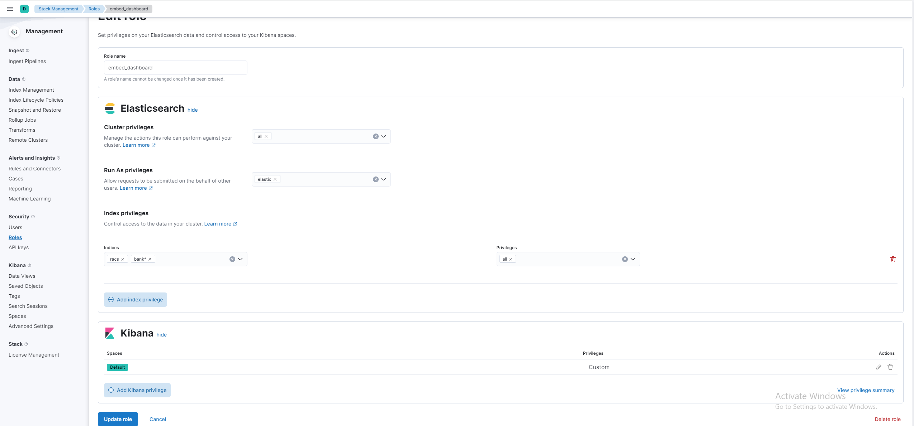
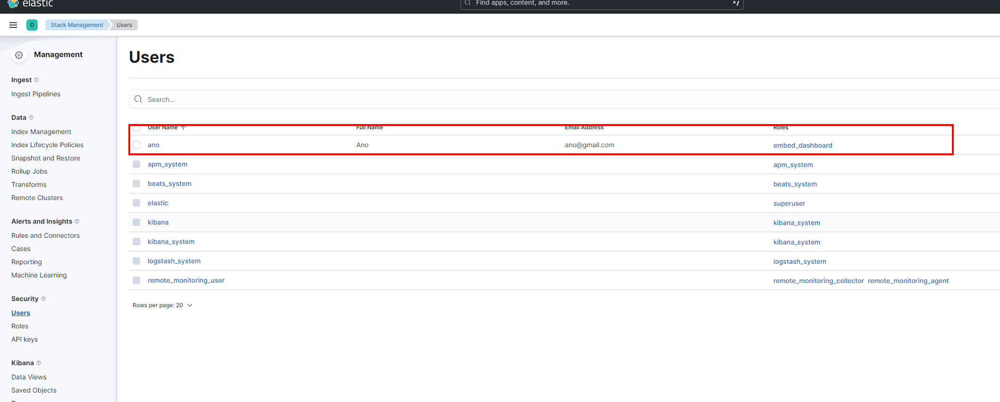

# Cài đặt và sử dụng ELK 8.5.1 - Elasticsearch - Logstash - Kibana

> Sử dụng Logstash để đồng bộ dữ liệu từ mysql
> Elastic để lưu trữ và truy vấn dữ liệu
> Kibana để visuallize data

# Truy cập

-   Truy cập Kibana: localhost:5601
-   Truy cập Elastic: localhost:9200

# Cài đặt

-   Sử dụng docker
    Chú ý xem lại đường dẫn trong file docker-compose.yml
    Elastic hiện tại đang không sử dụng SSL

```
Chạy lệnh docker-compose up -d
```

-   Sau khi khởi chạy, chạy bash vào trong elastich như sau

```
docker exec -it sem_elasticsearch bash
```

-   Tạo mật khẩu truy cập

```
/usr/share/elasticsearch/bin/elasticsearch-setup-passwords auto
```

-   Cập nhật tài khoản truy cập vào trong file filebeat.yml, kibana.yml, logstash.yml và các file pipeline.conf
-   Thoát bash elastic, truy cập vào bash của kibana

```
docker exec -it sem_kibana bash
```

-   Tạo key cho kibana

```
/usr/share/kibana/bin/kibana-encryption-keys generate --force
```

-   Cập nhật key vừa tạo vào trong file kibana.yml

-   Cấu hình thêm 1 pipline mới cho logstash, thêm dòng cấu hình tương tự như sau vào trong file piplines.yml

```
- pipeline.id: name-pipeline
   path.config: "/usr/share/logstash/pipeline/name-pipeline.conf"
```

-   Tạo file name-pipeline.conf trong thư mục pipeline, tham khảo file có sẵn trong thư mục(note\logstash\pipeline\movie_cast_index.conf), chú ý cập nhật mật khẩu tạo ở elastic bước trên vào trong file để có thể đồng bộ dữ liệu
-   Tham khảo thêm các phần liên quan tới jdbc-streaming, filter để có thể tùy chỉnh dữ liệu đầu ra như ý muốn.
    [https://www.elastic.co/guide/en/logstash/current/plugins-filters-jdbc_streaming.html](https://www.elastic.co/guide/en/logstash/current/plugins-filters-jdbc_streaming.html)

# Embed report

Để có thể embed report cần login vào kibana với tài khoản elastic, vào phần Role -> tạo role phù hợp (chỉ xem), và chỉ định các indece được phép xem
Sau đó tạo user tương ứng, chú ý rằng tài khoản và mật khẩu của user này sẽ được cấu hình ở trong kibana.yml, ví dụ file hiện tại là ano/123456


